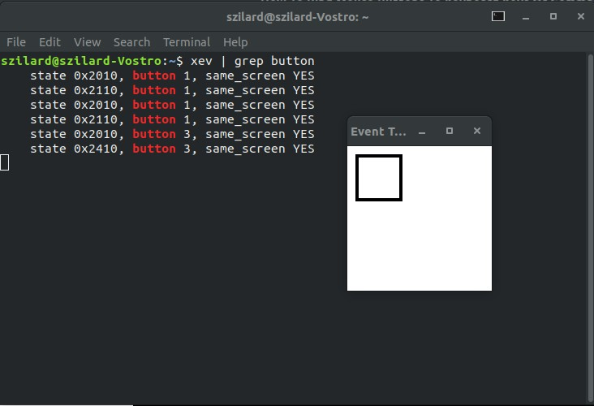

# Remap-Mouse-buttons-to-copy-paste on Ubuntu

This README shows an alternative for the X-mouse button for on windows.

## Step 1: install needed libraries

```bash
$ sudo apt-get install xbindkeys x11-utils
$ sudo apt-get install xautomation
```
## Step 2: Map your mouse keys

```bash
$ xev | grep button
```

Press the keys which you want to modify on the rectangle (Figure 1)



Figure 1. xev interactive window

## Step 3: Create an xbindkeys config

Generate configuration file, and open it

```bash
$ xbindkeys -d > ~/.xbindkeysrc
$ gedit ~/.xbindkeysrc
```

## Step 4: Modify configuration

Add copy paste command to the keys to bind it [2]. The comment shows where I put this into the file.

```bash
# set directly keycode (here control + f with my keyboard)
#"xterm"
#  c:41 + m:0x4

"xte 'keydown Control_L' 'key c' 'keyup Control_L'"
	b:9

"xte 'keydown Control_L' 'key v' 'keyup Control_L'"
	b:8
```

## Step 5: Restart and run xbindkeys

```bash
$ killall xbindkeys
$ xbindkeys
```

## Notes:
I try to do this `xdotool` as well based on this [2] post. The solution did it's job, but if I pressed the mouse button, it froze the operating system for 1 sec. 

[1] https://askubuntu.com/questions/18385/binding-mouse-buttons-to-copy-and-paste
[2] https://www.linuxuprising.com/2019/11/how-to-bind-mouse-buttons-to-keyboard.html